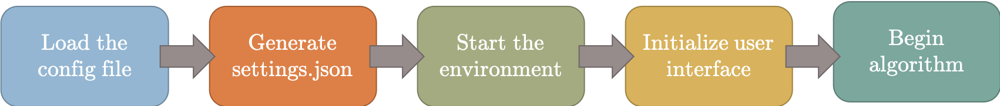
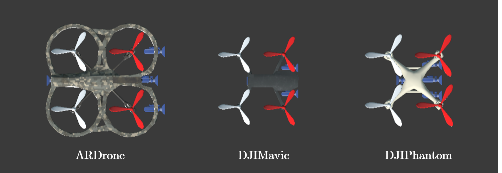

# Programmable Engine for Drone Reinforcement Learning (RL) Applications (PEDRA-2.0)

[](https://www.youtube.com/watch?v=ivQkhl494Sc)

## Updates in version 2.0:
1. Support of multi-drone environments.
2. Support of Outdoor Environment.
3. Improved and generalized code structure.
4. Better and detailed documentation

It is recommended to use version 2.0 of PEDRA due to improved stability. If you still want to use PEDRA 1.0 it can be downloaded from [here](https://github.com/aqeelanwar/PEDRA/tree/PEDRA-v1)

The tutorial/guidelines to PEDRA is divided into 4 reamde files
1. Main readme file (this one)
2. [Environments readme file](/unreal_envs/readme.md)
3. [Algorithms readme file](/algorithms/readme.md)
4. [FAQ readme file](faq.md)

# What is PEDRA?
PEDRA is a programmable engine for Drone Reinforcement Learning (RL) applications. The engine is developed in Python and is module-wise programmable. PEDRA is targeted mainly at goal-oriented RL problems for drones, but can also be extended to other problems such as SLAM etc. The engine interfaces with Unreal gaming engine using AirSim to create the complete platform. Figure below shows the complete block diagram of the engine. [Unreal engine](https://www.unrealengine.com/en-US/) is used to create 3D realistic environments for the drones to be trained in. Different level of details can be added to make the environment look as realistic or as required as possible. PEDRA comes equip with a list of 3D realistic environments that can be selected by user. Once the environment is selected, it is interfaced with PEDRA using using [AirSim](https://github.com/microsoft/AirSim). AirSim is an open source plugin developed by Microsoft that interfaces Unreal Engine with Python. It provides basic python functionalities controlling the sensory inputs and control signals of the drone. PEDRA is built onto the low level python modules provided by AirSim creating higher level python modules for the purpose of drone RL applications.


# PEDRA Workflow
The complete workflow of PEDRA can be seen in Figure below. The engine takes input from a config file (.cfg). This config file is used to define the problem and the algorithm for solving it. It is algorithmic specific and is used to define algorithm related parameters. Right now the supported problem is camera based autonomous navigation and the supported algorithms are single drone vanilla RL, single drone PER/DDQN based RL. More problems and associated algorithms are being added.
The most important feature of PEDRA is the high level python modules that can be used as building blocks to implement multiple algorithms for drone oriented applications. The user can either select from the above mentioned algorithms, or can create their own using these building blocks. In case the user wants to define their own problem and associated algorithm, these building blocks can be used. Once these requirements are set, the simulation can begin. PyGame screen can be used to control simulation parameters such as pausing the simulation, modifying algorithmic or training parameters, overwrite config file and save the current state of the simulation etc.  PEDRA generates a number of output files. The log file keeps track of the simulation state per iteration listing useful algorithmic parameters. This is particularly useful when troubleshooting the simulation. Tensorboard can be used to visualize the training plots in run-time. These plots are particularly useful to monitor training parameters and to change the input parameters using the PyGame screen if need be.


# Installing PEDRA
The current version of PEDRA supports Windows and requires python3. Make sure to use python 3.6 to avoid issues during the installation of required packages. It’s advisable to [make a new virtual environment](https://towardsdatascience.com/setting-up-python-platform-for-machine-learning-projects-cfd85682c54b) for this project and install the dependencies. Following steps can be taken to download get started with PEDRA

## Clone the repository
To make things simple and easier, PEDRA comes equip with two versions.
* __PEDRA__: Single drone support:
* __D-PEDRA__: Distributed multiple drones support

Each of this version is a branch in the repository and can be downloaded as follows
```
# PEDRA Single Drone
git clone --single-branch --branch PEDRA https://github.com/aqeelanwar/PEDRA.git

# Distributed PEDRA Multiple Drones
git clone --single-branch --branch D-PEDRA https://github.com/aqeelanwar/PEDRA.git
```


## Install required packages
Make sure you use python 3.6, otheriwise the required packages installation might have issues. The provided requirements.txt file can be used to install all the required packages. Use the following command

### System with NVIDIA GPU
```
cd PEDRA
pip install –r requirements_gpu.txt
```

### System without NVIDIA GPU
```
cd PEDRA
pip install –r requirements_cpu.txt
```

This will install the required packages in the activated python environment.


## Install Epic Unreal Engine
The provided simulated environments are created using Unreal gaming engine. In order for these environments to run, you need to have unreal engine installed on the machine. You can follow the guidelines in the link below to install Unreal Engine on your platform. It is advisable to install Unreal Engine version 4.18.3.

[Instructions on installing Unreal engine](https://docs.unrealengine.com/en-US/GettingStarted/Installation/index.html)


# Running PEDRA
Once you have the required packages and software installed, you can take the following steps to run the code

## Download a simulated environment
You can either manually create your own environment using Unreal Engine (See FAQ below to install AirSim Plugin if you plan on creating your own environment), or you can download one of the environments from the link below.

[Download Environments](https://gtvault-my.sharepoint.com/:f:/g/personal/manwar8_gatech_edu/EnCc2xWKBCpIkWseegrp1EYB69y0zS3nLqzsaSfE-KAD4g?e=HtI1ck)

Following environments are available for download

* Indoor Environments:
  * Indoor Long Environment
  * Indoor Twist Environment
  * Indoor VanLeer Environment
  * Indoor Techno Environment
  * Indoor Pyramid Environment
  * Indoor FrogEyes Environment
  * Indoor GT Environment
  * Indoor Complex Environment
  * Indoor UpDown Environment
  * Indoor Cloud Environment


* Outdoor Environments:
  * Outdoor Courtyard
  * Outdoor Forest
  * Outdoor OldTown


More details on the environments can be found here [environment readme](unreal_envs/readme.md).

The link above will help you download the packaged version of the environment for 64-bit windows. Extract and save it in the unreal_env folder.

```
# Generic
|-- PEDRA
|    |-- unreal_envs
|    |    |-- <downloaded-environment-folder>


# Example
|-- PEDRA
|    |-- unreal_envs
|    |    |-- indoor_cloud
|    |    |-- outdoor_forest
|    |
```


## Edit the configuration file
Two types of configuration files are available to control general simulation parameters and algorithmic-specific parameters which can be found in the configs folder

### Simulation configurations:
```
|-- PEDRA
|    |-- configs
|    |    |-- config.cfg
```

This config file is used to set high-level simulation parameters. The complete list of parameters and their explanation can be seen below.

#### General Parameters [general_params]:

| Parameter            | Explanation                                                                          | Possible values                      |
|------------------    |-----------------------------------------------------------------------------------   |----------------------------------    |
| run_name             | Name for the current simulation                                                      | Any value                        |
| env_type             | Type of the environment (to be used in future versions)                              | indoor/outdoor                       |
| env_name             | Name of the environment to be used in the simulation                                 | indoor_cloud, indoor_techno etc.     |
| ip_address        | IP address used to communicate between PEDRA and the environment                                                       | e.g. 127.0.0.1                     |
| algorithm         | The algorithm that needs to be implemented. Details in PEDRA/algorithms/readme.md   | e.g. DeepQLearning                |
| mode                 | Dictates the mode you want to run the simulation in                              | train / infer / move_around                      |


#### Drone Parameters [drone_params]:

| Parameter            | Explanation                                                                          | Possible values                      |
|------------------    |-----------------------------------------------------------------------------------   |----------------------------------    |
| SimMode           | Selects one of the two modes for the drone in the simulation                        | ComputerVision / Multirotor       |
| num_agents        | Number of drones/agents to be used in the simulation         | Any integer > 0                    |
| drone             | Selects among the 3 drone models                                                    | ARDrone / DJIMavic, DJIPhantom    |
| ClockSpeed        | Dictates the simulation speed                                                       | Any value > 0                     |


#### Camera Parameters [camera_params]:


| Parameter            | Explanation                                                                          | Possible values                      |
|------------------    |-----------------------------------------------------------------------------------   |----------------------------------    |
| width              | Width of the camera frame                                                           | Any integer > 0                      |
| height           | Height of the camera frame                                                           | Any integer > 0                   |
| fov_degrees      | Camera field of view in degrees                                                   | Any value >0                     |


### Algorithm-specific configurations:
```
# Example
|-- PEDRA
|    |-- configs
|    |    |-- DeepQLearning.cfg
|    |    |-- DeepREINFORCE.cfg
```

Based on the algorithm selected in the general_param category of the main config file (config.cfg), algorithm-specific config file needs to be edited for user provided parameters. More details on this can be found [here](/algorithms/readme.md)


## Run the Python code
Once the config files have been edited according to the user needs, the simulation can be started using the main.py file


```
cd PEDRA
python main.py
```

Running main.py carries out the following steps



* Attempt to load the config files
* Attempt to generate the settings.json file required to specify the environment parameters
* Attempt to start the selected 3D environment
* Attempt to initialize PyGame screen for user interface
* Attempt to begin the algorithm


To speed up the algorithm, the environment rendering is turned off. A detailed documentation on how
to interact with the environment graphics can be seen [here](/unreal_envs/readme.md). In order to see if the drone is 
moving around the environment, hit the key 'Z' on the environment screen. A floorplan containing the drone will appear in the
top right corner.


## Available drone agents:
PEDRA comes equip with 3 drones
1. ARDrone
2. DJIMavic
3. DJIPhantom

The images of these drones can be seen below.

Different action space can be associated with each of these drones. The config file can be used to select one of these drones.


## Supported modes:
The config file can be used to select the mode the simulation needs to be run in.
* __train__:        Signifies the training mode, used as an input flag for algorithm to be implemented
* __infer__:        Signifies the inference mode, used as input flag for the algorithm to be implemented. Custom weights can be loaded into the network by setting the following parameters

```
custom_load_path: True
custom_load_path: <path_to_weights>
```
* __move_around__:  When mode is set to move_around, the simulation starts the environment in free mode. In this mode, keyboard can be used to navigate across the environment. This mode can help the user get an idea of the environment dynamics. The keyboard keys __a, w, s, d, left, right, up and down__ can be used to navigate around.  This can also be helpful when identifying for initial positions for drone. More details [here](unreal_envs/readme.md)

## Viewing learning parameters using tensorboard
During simulation, tensorflow parameters such as epsilon, learning rate, average Q values, loss and return can be viewed on the tensorboard. The path of the tensorboard log files depends on the env_type, env_name and train_type set in the config file and is given by
```
models/trained/<env_type>/<env_name>/Imagenet/   # Generic path
models/trained/Indoor/indoor_long/Imagenet/      # Example path
```

Once identified where the log files are stored, following command can be used on the terminal to activate tensorboard.
```
cd models/trained/Indoor/indoor_long/Imagenet/
tensorboard --logdir <train_type>                # Generic
tensorboard --logdir e2e                         # Example
```

The terminal will display the local URL that can be opened up on any browser, and the tensorboard display will appear plotting the DRL parameters on run-time.


## Run-time controls using PyGame screen
Algorithmic specific controls can be defined and accessed using the PyGame screen. More information can be found [here](algorithms/readme.md)


## Output graphs
The simulation updates two graphs in real-time. The first graph is the altitude variation of the drone, while the other one is the drone trajectory mapped onto the environment floorplan. The trajectory graph also reports the total distance traveled by the drone before crash.


More algorithm specific graphs can be added by making use of the floorplan provide with the environment.


# Example: Deep Reinforcement Learning with Transfer Learning (DRLwithTL-Sim)

DRLwithTL is a transfer learning based approach to reduce on-board computation required to train a deep neural network for autonomous navigation via Deep Reinforcement Learning for a target algorithmic performance. PEDRA provided environments are used to train the network on a set of meta-environments. These trained meta-weights are then used as initializers to the network in test environments and fine-tuned for the last few fully connected layers. Variation in drone dynamics and environmental characteristics is carried out to show robustness of the approach. The repository containing the code for real environment on a real DJI Tello drone can be found @ [DRLwithTL-Real](https://github.com/aqeelanwar/DRLwithTL_real)
## Introductory Video
[](https://youtu.be/zmR0KB_qle8)

## PEDRA config for DRLwithTL
PEDRA's config file can be used to carry out DRLwithTL. The parameter train_type can be used to dictate how many layers from the end needs to be trained.


# Citing
If you find this repository useful for your research please use the following bibtex citations

```
@ARTICLE{2019arXiv191005547A,
       author = {Anwar, Aqeel and Raychowdhury, Arijit},
        title = "{Autonomous Navigation via Deep Reinforcement Learning for Resource Constraint Edge Nodes using Transfer Learning}",
      journal = {arXiv e-prints},
     keywords = {Computer Science - Machine Learning, Statistics - Machine Learning},
         year = "2019",
        month = "Oct",
          eid = {arXiv:1910.05547},
        pages = {arXiv:1910.05547},
archivePrefix = {arXiv},
       eprint = {1910.05547},
 primaryClass = {cs.LG},
       adsurl = {https://ui.adsabs.harvard.edu/abs/2019arXiv191005547A},
      adsnote = {Provided by the SAO/NASA Astrophysics Data System}
}
```
```
@article{yoon2019hierarchical,
  title={Hierarchical Memory System With STT-MRAM and SRAM to Support Transfer and Real-Time Reinforcement Learning in Autonomous Drones},
  author={Yoon, Insik and Anwar, Malik Aqeel and Joshi, Rajiv V and Rakshit, Titash and Raychowdhury, Arijit},
  journal={IEEE Journal on Emerging and Selected Topics in Circuits and Systems},
  volume={9},
  number={3},
  pages={485--497},
  year={2019},
  publisher={IEEE}
}
```

## Authors
* [Aqeel Anwar](https://www.prism.gatech.edu/~manwar8) - Georgia Institute of Technology

## License
This project is licensed under the MIT License - see the [LICENSE.md](LICENSE) file for details

