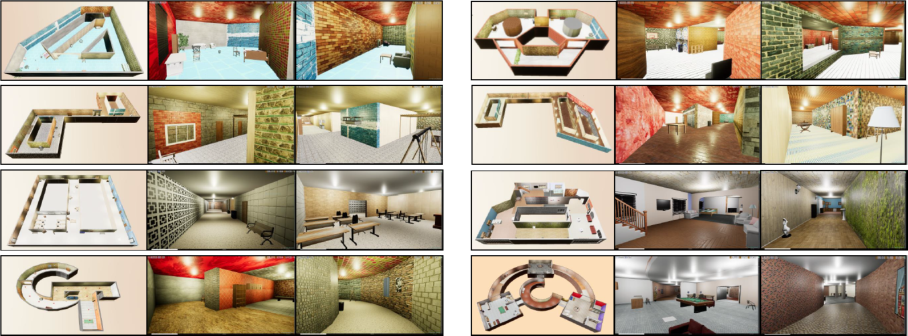
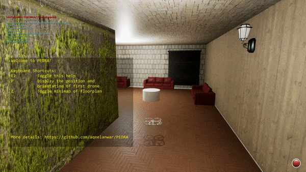
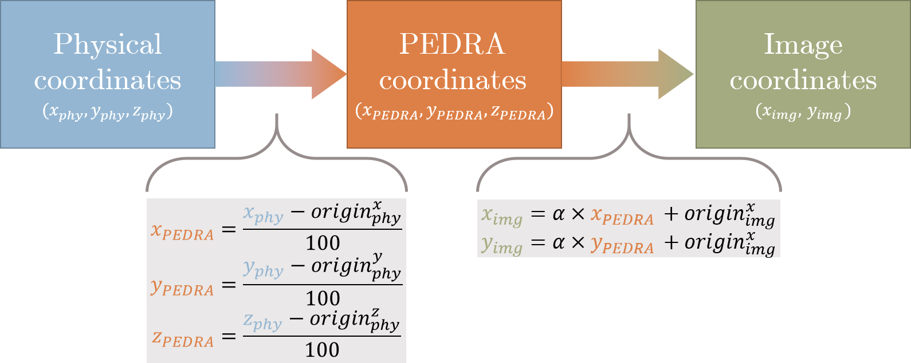
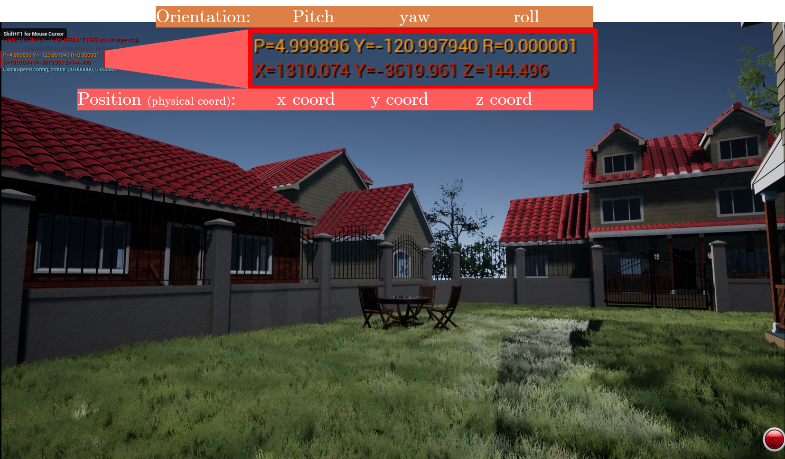
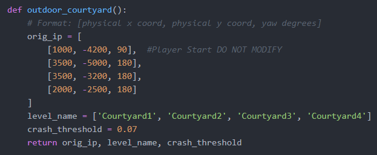
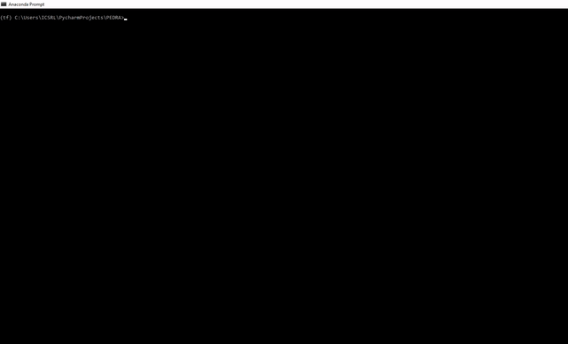

# PEDRA - Environments

<p align="center">

</p>


PEDRA comes equip with a library of 3D realistic environments that can be used for drone applications. The environments fall into two categories.

* Indoor Environments:
  * [Indoor Long Environment](https://www.youtube.com/watch?v=QsSAXgIV8LA&list=PLPF003gzWEyGB-gSAA2k-U5Lv9cXGp9dG&index=6)
  * [Indoor Twist Environment](https://www.youtube.com/watch?v=g-YYvRfv2-E&list=PLPF003gzWEyGB-gSAA2k-U5Lv9cXGp9dG&index=12)
  * [Indoor VanLeer Environment](https://www.youtube.com/watch?v=isf_SWWdWAI&list=PLPF003gzWEyGB-gSAA2k-U5Lv9cXGp9dG&index=3)
  * [Indoor Techno Environment](https://www.youtube.com/watch?v=IxKCd93rm30&list=PLPF003gzWEyGB-gSAA2k-U5Lv9cXGp9dG&index=2)
  * [Indoor Pyramid Environment](https://www.youtube.com/watch?v=r4O2qDQRpbc&list=PLPF003gzWEyGB-gSAA2k-U5Lv9cXGp9dG&index=7)
  * [Indoor FrogEyes Environment](https://www.youtube.com/watch?v=TwNFu06UdQo&list=PLPF003gzWEyGB-gSAA2k-U5Lv9cXGp9dG&index=4)
  * [Indoor GT Environment](https://www.youtube.com/watch?v=yc4j727R2i0&list=PLPF003gzWEyGB-gSAA2k-U5Lv9cXGp9dG&index=5)
  * [Indoor Complex Environment](https://www.youtube.com/watch?v=ztMyCdLb3Fg&list=PLPF003gzWEyGB-gSAA2k-U5Lv9cXGp9dG&index=13)
  * [Indoor UpDown Environment](https://www.youtube.com/watch?v=PkKUNod30SE&list=PLPF003gzWEyGB-gSAA2k-U5Lv9cXGp9dG&index=8)
  * [Indoor Cloud Environment](https://www.youtube.com/watch?v=qAUzzDQEweA&list=PLPF003gzWEyGB-gSAA2k-U5Lv9cXGp9dG&index=14)


* Outdoor Environments:
  * [Outdoor Courtyard](https://www.youtube.com/watch?v=TX-QJc3aO3c&list=PLPF003gzWEyGB-gSAA2k-U5Lv9cXGp9dG&index=11)
  * [Outdoor Forest](https://www.youtube.com/watch?v=f0EeGkngC4w&list=PLPF003gzWEyGB-gSAA2k-U5Lv9cXGp9dG&index=10)
  * [Outdoor OldTown](https://www.youtube.com/watch?v=qb3xc_FbACk&list=PLPF003gzWEyGB-gSAA2k-U5Lv9cXGp9dG&index=9)

<!-- TODO: -->
<!-- The videos above is a walk through different environments so it helps you to pick based on your needs instead of downloading it and then looking at it. -->

## Downloading the environments
The compressed zip file of environments can be downloaded from [here](https://drive.google.com/drive/folders/1CliGXB4qQflgc4lNKLkOUUp8mntejj8h?usp=sharing). Once downloaded, extract the zip file into the unreal_envs folder


## Environment file structure:
Each of the provided environments has the following three categories of files

```
|-- <environment_name>
|    |-- .exe file
|    |-- other folders
|    |-- <env_name>_floor.png
|    |-- config.cfg
```

### Unreal simulation files
These files and folder are the simulation files for packaged unreal project and are not to be modified in any way (.exe, DRLwithTL, Engine etc)

### Floorplan
A .png image file of the floorplan of the environment. This can come in handy when plotting the trajectory of the drone in the inference mode, to keep track of multiple drones in the environment and to extract drone positions in the environment.  


### Config file
Each environment comes with a config file. This config file includes the parameters used to set the environment up. Following is the list of parameters in this config file and its explanation. This config file __should not be edited__.


| Parameter        	| Explanation                                                        |
|------------------	|--------------------------------------------------------------------|
| env_name         	| Name for the environment this config file is associated with       |
|floorplan:          | The name of the floorplan image file                              |
|o_x:                |X coordinates of origin (player start) in the image coordinates |
|o_y:                |Y coordinates of origin (player start) in the image coordinates |
|alpha:              |The scaling constant from PEDRA coordinates to image coordinates |
|ceiling_z:          |Height of the ceiling in physical coordinates |
|floor_z:            |Height of the floor in physical coordinates |
|player_start_z:     |Height of the origin (player start) in physical coordinates |


The image coordinates, PEDRA coordinates and physical coordinates are explained below. In case of an outdoor environment, the value of ceiling_z is set to 10000 meaning that there is no ceiling.


## Environment Supported Features:
While the simulation screen is on, following keys can be used to interact with it.


| Key        	      | Feature                                                           |Category      |
|------------------	|-------------------------------------------------------------------|--------------|
| F2         	      | Toggle PEDRA help                                                 |PEDRA         |
| P          	      | Display current position (x,y) and orientation (yaw) of the drone |PEDRA         |
| Z         	      | Toggle the floorplan minimap                                      |PEDRA         |
| 1         	      | Toggle depth map as subwindow                                     |AirSim        |
| 2         	      | Toggle segmentation map as subwindow                              |AirSim        |
| 3         	      | Toggle image from front facing camera as subwindow                |AirSim        |


<p align="center">

</p>

More PEDRA environmental features will be added in the future releases.


## Understanding the coordinates and conversion between them:
There are three kind of coordinates in which the drone position can be expressed in.
1. Physical coordinates:      The coordinates of the drone in the environment (Hitting Key P displays this coordinates)
2. PEDRA coordinates (AirSim Coordinates): The coordinates of the drone relative to the origin (player start). This is the coordinate in which PEDRA deals. Whenever a request is made from PEDRA to get the current position of the drone through AirSim, these coordinates are returned and vice versa.
3. Image based coordinates: The coordinates of the drone in the floorplan image. It is a mapping of the actual drone coordinates onto the image map.

<p align="center">

</p>

<p align="center">

</p>

Within PEDRA, we always use the PEDRA coordinates to deal with drone positions with an exception being the environments/initial_positions.py file. In this file the drone coordinates are expressed in the physical coordinates.


## Extracting position of the drone in the environment
Even before running your algorithm, you might want to define some key positions for the drone. For example, which position the drone should reset to after crash, what should be the goal position of the drone etc. This includes finding a suitable drone position in the environment and extracting the coordinates of this position

PEDRA provides two ways of doing that
### 1. Running PEDRA in move_around mode:
This can be done by setting the config.cfg file to move_around mode. In this mode, keyboard can be used to navigate across the environment. This mode can help the user get an idea of the environment dynamics. The keyboard keys __a, w, s, d, left, right, up and down__ can be used to navigate around. Once the user navigates the drone to position of his/her linking, key P on the keyboard can be used to display the position of the drone on the left top part of the simulation screen. Each position array displayed has three parts
```
[pitch, yaw, roll]                                # Degrees
[x coordinates, y coordinates, z coordinates]     # Physical coordinates
```


<p align="center">

</p>


These values can directly be fed into the orig_ip variable of the environments/initial_positions.py file in the following format making it accessible to PEDRA code
```
[x coord, y coord, yaw]
```
<p align="center">

</p>


### 2. Running retreive_initial_position.py:
The second way of extracting desirable drone position is to use the python file retreive_initial_position.py
```
cd PEDRA
python retrieve_initial_position.py
```
Running this will open the directory for the user to select the floorplan of the required environment. Once the user selects the floorplan, moue cursor can be used to click in the floorplan to extract the drone coordinates. All three coordinates corresponding to the position selected are displayed on the left top part of the display window.
In order to use these coordinates in the initial_positions.py file, make sure you use the physical coordinates.

<p align="center">

</p>
